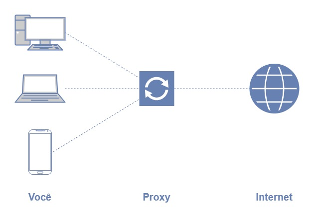
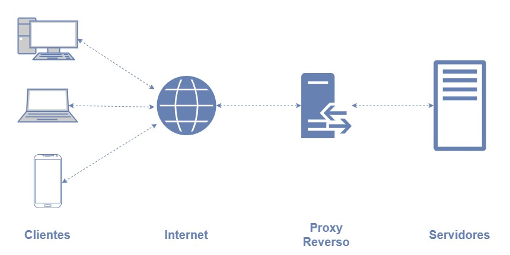
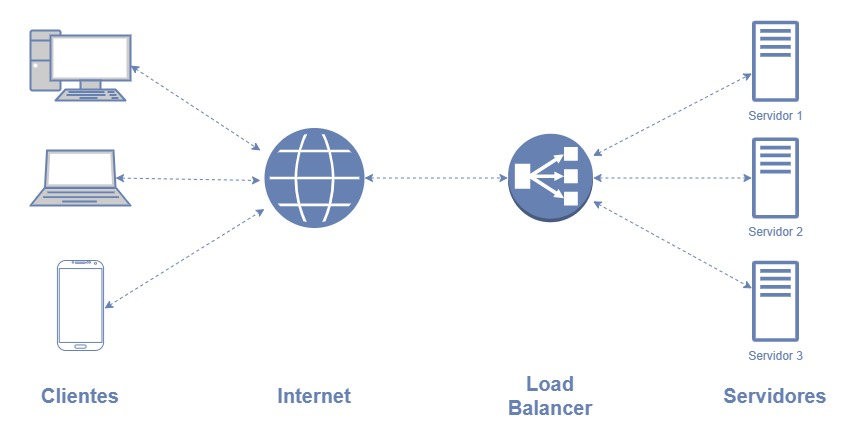

# Proxy Reverso + Load Balancer with Nginx

A basic and simple example of an application running with reverse proxy and load balancing with nginx.

To do this, I created a web server written in Node.js and Express. After that, I used Docker to build an image and use it with Docker Compose to have more than one instance of the application running with a load balancer configured in Nginx. Below are the steps I took.

## The steps

### Creating the application with Node.js + Express

```javascript
import express from "express";
import os from "os";

const app = express();

app.get("/", (req, res) => {
  res.send(`Hello from ${os.hostname()}`);
});

app.listen(3000, () => {
  console.log("Server listening on port 3000");
});
```

### Dockerizing the application with Docker

```docker
FROM node:alpine

WORKDIR /app

COPY . .

RUN npm ci

CMD [ "node", "index.js" ]

USER node
```

### Configuring reverse proxy and load balancer with Nginx

```properties
events {
    worker_connections 1024;
}

http {
    upstream app {
        server app1:3000 weight=1;
        server app2:3000 weight=1;
    }

    server {
        listen 80;
        listen [::]:80;

        server_name app.127.0.0.1.nip.io;

        location / {
            proxy_pass http://app;
        }
    }
}
```

Here, I used the Round Robin load balancer algorithm, notice the two servers declared in the upstream with the same weight:

```properties
upstream app {
    server app1:3000 weight=1;
    server app2:3000 weight=1;
}
```

And also notice the reverse proxy I made in the server configuration, pointing the named upstream app:

```properties
server {
    listen 80;
    listen [::]:80;

    server_name app.127.0.0.1.nip.io;

    location / {
        proxy_pass http://app;
    }
}
```

The "Round Robin" algorithm is one of the simplest and widely used load balancing algorithms. When configured with Nginx, the Round Robin load balancer evenly distributes requests across the available servers. This approach is effective in evenly distributing load across servers, ensuring that no server becomes overloaded while others remain underutilized. However, it is important to note that the Round Robin algorithm does not take into account the real load or capacity of the servers; it simply forwards requests in a predefined order.

### Defining application instances + Nginx with Docker Compose

```yaml
version: "3.8"

networks:
  local:

services:
  nginx:
    image: nginx:alpine
    volumes:
      - ./nginx/nginx.conf:/etc/nginx/nginx.conf
    ports:
      - 80:80
    depends_on:
      - app1
      - app2
    networks:
      - local

  app1:
    build: ./app
    hostname: app1
    networks:
      - local

  app2:
    build: ./app
    hostname: app2
    networks:
      - local
```

Note the services `app1` and `app2`. These are the instances running on the load balancer.

## How to run this project

To run this project just clone this repo and run the docker compose file. To run, you just need Git, Docker and Docker Compose installed in your machine.

```bash
git clone https://github.com/dalloglio/reverse-proxy-load-balancer-nginx.git

cd reverse-proxy-load-balancer-nginx

docker compose up -d
```

Now, you can go to your preferred browser and navigate to http://app.127.0.0.1.nip.io and each time you refresh the page you will first see the app running on the `app1` service and the next time you will see the app running on the service `app2` and so on.

Application running on `app1`


Application running in `app2`


## The concepts

To talk about reverse proxy, I need to first explain the difference between proxy and reverse proxy. I will explain it in a simple and accessible way.

### Proxy

A proxy is like an intermediary between you and the final destination on the internet. Imagine you want to access a website, but instead of you connecting directly to that website, you connect to a proxy first. The proxy then forwards your request to the website and receive its response, which is then sent back to you. This can be useful for various reasons, such as protecting your privacy, bypassing network restrictions, or improving performance.



### Reverse Proxy

A reverse proxy works similarly to a regular proxy, but instead of forwarding client requests to externar servers, it forwards client requests to internal servers. For example, if a company has multiple internal web servers, a reverse proxy can receive requests from external clients and forward them to the appropriate internal server. This helps protect the internal servers and balance the workload between them.



### Load Balancer

A load balancer is like a traffic manager that distributes client requests among multiple servers. It helps ensure that no one server becomes overloaded by evenly distributing requests among them. This is especially useful in environments where many clients are accessing a service simultaneously. The load balancer can monitor the performance of each server and redirect traffic as needed to ensure a smooth and efficient operation.



## Nginx

Nginx is an open-source web server known for its high performance, scalability and low resource consumption. It is designed to handle a large volume of simultaneous requests efficiently. Nginx has gained popularity and is now widely used worldwide for hosting websites, web applications, and online services. Nginx is also commonly used as a reverse proxy, load balancer, caching server, and more. Its flexibility and capacity to handle a variety of tasks make it a popular choice for modern infrastructures. In short, Nginx is like a traffic manager for the internet, ensuring that user requests are served quickly, efficiently and sacurely.
